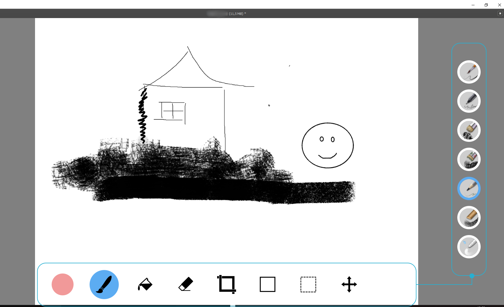
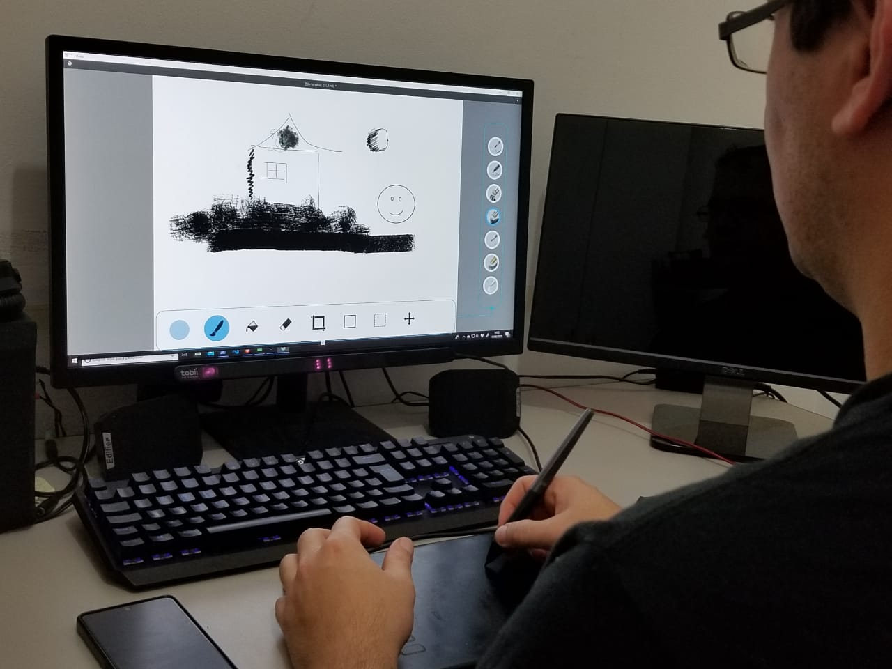

# GazeBar 

This is the repository for the proof of concept (PoC) of GazeBar, which was introduced in the Late-Breaking Works section at CHI 2021. GazeBar's prototype exploits the natural gaze paths users make when switching to different modes to perform selections by just looking at a mode in a digital painting application.

 


### Requirements

* Python 3.6+
* QT (via PySide2)
* Krita 4+
* Tobii 4C eye tracker
* Windows 10 OS


### Installing

GazeBar's PoC does not enforce the use of a specific eye tracker. It only requires a constant stream of predicted eye gaze position on screen. However, we have only tested GazeBar with the Tobii 4C, so we are bundling a `stream/streamer.exe` binary that is strictly compatible with the 4C. In case the precompiled binary is incompatible with your system, check the build parameters in `stream/compile.py`, or plug your own streamer according to `stream/streamer.cs`.

Once everything is set hardware-wise, it is now time to install some Python packages:

```
pip install -r requirements.txt
```

After that, we need to install and configure Krita, which is an open-source digital painting application used as the primary task for GazeBar. Our PoC communicates with Krita via keyboard shortcuts that are emulated in our application when there is a selection. To do that, download Krita and follow its installation instructions:

```
https://krita.org/en/download/krita-desktop/
```


### Configuring

Before running the PoC, a last manual effort is still required: to map all the tools used by GazeBar as keyboard hotkeys to Krita. To do that, open Krita main settings and search for the "Keyboard Shortcuts" option. To know what tools need to be mapped, look for the `tools` dictionary in the file `main.py`. This is a pretty straight-forward process but a laborious one (there are 23 mappings at total). Please refer to Krita's official documentation if you are still unsure about it:

```
https://docs.krita.org/en/reference_manual/preferences/shortcut_settings.html
```


### Running

With everything set, start Krita and then GazeBar by calling on Window prompt:

```
python main.py
```

Note that the use of transparency in QT can be a little glitchy sometimes, so if you see a black screen when starting up GazeBar, just click on it to make it go away. 

Gaze point feedback is also deactivated by default, so if you need to check whether eye gaze data is being captured or not, you can enable gaze feedback in `painting_tool.qml`

For further details about GazeBar's design and interactive mechanics, please refer to our paper: Elmadjian, C.E.L. and Morimoto, C.H. - *GazeBar: Exploiting the Midas Touch in Gaze Interaction*.  

